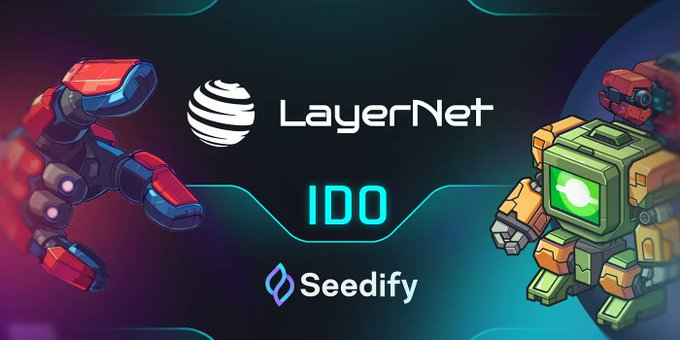

# Netcoin by LayerNet
LayerNet is a game layer built on Telegram, leveraging Solana's blockchain technology. The project provides 900 million Telegram users with an optimal Roll-up solution specifically for blockchain games, allowing a smooth Web3 gaming experience at a low cost. The platform provides the first zk-based infrastructure on Solana with zero gas fees and high security, working well with tools like Phantom.
### BOT PICTURE

### FUTURE:
- Auto claim
- Play catch game
- AUto buy and update wepon
- Auto get daily reward
- Use proxy

### Contact me
- telegram : @trautv1 | @hoanganhcoder
- facebook : https://www.facebook.com/hoanganhvazuta
- gmail : hoanganhfreelancer@gmail.com
